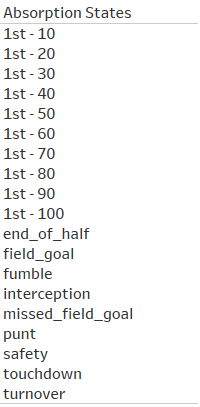
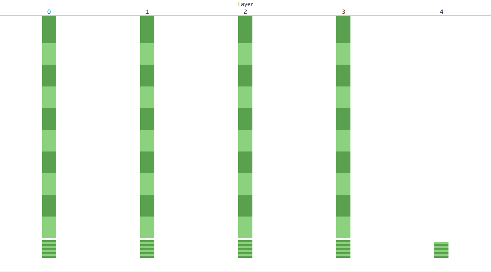

# NFL-Down-Set-Outcome-Prediction

The purpose of this repo is to provide an approach to predict the outcome distribution of a set of NFL downs using neural networks. More specifically, doing so by applying an architecture and training procedure which can estimate the underlying markov process at work, circumventing the inherint sample size and dimensionality limitations when using historical state-to-state transition data. 

## Markov Process

A markov chain is a process whereby the next state only (t) depends on the preceding state (t-1) and is independant of any earlier states (i.e. t-2). This is a useful model of NFL downs which can be considered as states in a process. For example; if a team has the ball 10 yards away from the opposing team's goal line, to predict the liklihood of the team getting a touchdown in the drive, it's not pertinent that ball possession had just been attained after a fumble. 

To meaningfully delineate different NFL down states, 3 descriptive dimensions of the down can be used - the yardline (in comparison to the opposition), the yards to go to reach a first down, and what the current down is. 

Given the yardline and yards to go are continuous quantities, binning is required in order to delineate a finite number of states. For the proof of concept in this analysis, their values will be binned into buckets of 10, and 1, respectively. A ceiling approach will be used. For example, if a down is at the 42 yardline of the defensive team, it will be allocated to the 50 yardline bucket. A final bucket of 11 will be used to capture all yards to go above 10 (i.e. if a sack results in a 2nd down with 15 yards to go, it will be allocated to the 11 yards to go bucket). 

## Yardline by yards to go matrix

We can then visualize a football field with the yardline representing the length of the field. But to depict the various markov states, we can represent the width of the field with the yards to go to reach a first down.  

Because there are 10 yardline and 11 yards to go buckets, this will be a 10 X 11 matrix resulting in 110 states. 

## Absorption state

The goal is predict the the probability distribution of how a set of downs will conclude - it's 'absorption state' - by using the current state and accompanying features. 

The following 19 states will be used to categorize how a set of downs will conclude. 

# Downs as layers

However, we have yet to consider what the current down is (i.e. 1st or 2nd) and it's impact on the probability distribution of absorption states. 

To do so we will 'unroll' the previous 10 x 11 matrix of states horizonally into a vector, after which we will add an additional feature - the number of seconds remaining in the half. The design allows for the inclusion of additional features in the future like team embeddings, historical performance, and weather.

We then make 4 vertical stacks of this large feature vector and position them in a sequence, each stack being considered a down. Note that as before, within each 10 yard line buckets represented by colour, there are 11 yards to go buckets contained inside. 

The stacks will be consider as layers in a dense neural network. In the initial pass, a linear formula followed by a RELU activation will be used to map the current layers state to the probability* distribution of all states in the next layer (down). 

Because an absorption state can occur in any down 1-4, absorption states will also be considered in the feature stack for layers 1-3. This means that the total number of dimensions in these stacks is 10 yardlines x 11 yeards to go + 1 time feature + 19 absorption states (130). You'll see that layer 0 represents the 1st down; this is because this stack is only used for input data and not for model computations which start in the 1st layer. 

The final layer (4) only contains the 19 absorption states. A softmax activation function is used to ensure the model estimates the multi-class probability distribution of absorption states. 

# Dataset 

[NFL play-by-play data from 2009-2018](https://www.kaggle.com/datasets/maxhorowitz/nflplaybyplay2009to2016?resource=download) is used to train the model. 

# Libraries

The neural network including forward and backward propogation steps are built 'from scratch' using Python's numpy library for full flexibility in the training and prediction procedure. 

# Training Procedure

A teacher-forcing procedure is used to ensure the model recognizes the intented state structure. The procedure is as follows:

1. Down 4 data is considered as input features and fed into the 3rd layer stack to predict the absorption probability distribution (layer 4).
2. Down 3 data is considered as input features and fed into the 2nd layer stack to predict the absorption probability distribution (layer 4).
3. Down 2 (layer 1) weights and bias terms are initialized with those estimated for down 3. 
4. Down 2 data is considered as input features and fed into the 1st layer stack to predict the absorption probability distribution (layer 4). 
5. Down 1 (layer 0) weights and bias terms are initialized with those estimated for down 2. 
6. Down 1 data is considered as input features and fed into the 0th layer stack to predict the absorption probability distribution (layer 4). 

The procedure can be repeated for further training, omitting steps 3 and 5. 

# Prediction Procedure

A prediction function is developed that intakes the yardline, yards to go, down, and seconds remaining in the half, and provides the absorption state probability distribution. Within the function, yardline and yards to go are 'vectorized', multiplied, and unrolled. Similar to the training procedure, input data that indicated the 4th down is passed into the 3rd layer to get a prediction. 

One should note the possibility for circular applications. There are 10 possible absorption states where the drive continues, each distinguishing different yardlines. The initial prediction will provide the probability distribution across each of these states. However, these predicted states can also be fed into the model a subsequent time as they have an associated down (1), yardline, and yards to go (10 or more if the yardline decreased). An average duration of seconds passed per down can be considered for the seconds remaining feature. In accordance, the model can be applied iteratively and the associated chains of conditional probabilities can be summed to predict the absorption state probability distribution for a drive. 

Please see the [jupyter notebook](https://github.com/acharabin/NFL-Down-Set-Outcome-Prediction/blob/main/NFL-Down-Set-Outcome-Prediction.ipynb) for further information on model details and performance. 

